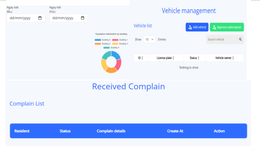

## PROJECT: HOMELAND WEB

### BUILDING A CONDOMINIUM MANAGEMENT WEBSITE
Instructor: Trần Tuấn Dũng
## Student Contributors:
Hồ Đình Mạnh - Student ID: 21522327

Võ Công Bình - Student ID: 21521880

Nguyễn Phước Hưng - Student ID: 21520252

Đinh Đại Dương - Student ID: 21521986

Nguyễn Thị Kim Ngân - Student ID: 20520915
## Technologies Used:
FrontEnd: 

BackEnd: NestJS

Other Technologies: Docker, Bootstrap, PostgreSQL, Supabase, Momo Payway, ChatGPT API,...

## 📚 Introduction
HomeLand is an apartment management website, it provides a centralized interface to view booking and appointment information, Manage communication with prospects, customers and tenants, Track maintenance work and clean up, create dashboards and visualizations for daily reporting.
## Functionalities
Information Management: Building information, residents, resident vehicles,...
Service Management: Expense management, service contracts, services (electricity, water,...)
Asset Management: Maintenance management and repair assignment
Financial Management: Fee calculation and issuance of fee notifications (linked to banking applications, e-wallets) through various forms such as email, SMS, printing, and within the application for residents. Financial reporting system and statistics on income and expenditure of fees in the condominium
Rental Contract Management: a library of templates that comply with all the latest standards, allowing you to create new leases. The system creates a data warehouse of all your rental data and sends notifications about expiring and terminated contracts. You can also include specialized clauses in your contract and automatically track violations and late fees.
Report Generation: Overall population statistics, you can export reports in many chart formats by date,....
Financial reports: The software provides the ability to automate a large portion of accounting and maintenance operations, distribute to owners and suppliers, submit financial reports, and manage regulatory compliance.
Complain & repair request: Enter a complaint comment and display a list of complaints.

## Illustrative Images:

