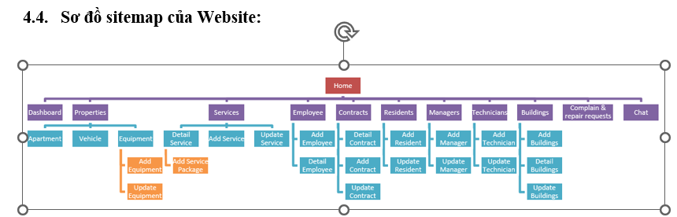

[Next.js](https://nextjs.org/) project bootstrapped with [`create-next-app`](https://github.com/vercel/next.js/tree/canary/packages/create-next-app).

## Getting Started

First, run the development server:

```bash
npm run dev
# or
yarn dev
# or
pnpm dev
# or
bun dev
```

Open [http://localhost:3000](http://localhost:3000) with your browser to see the result.

You can start editing the page by modifying `app/page.tsx`. The page auto-updates as you edit the file.

This project uses [`next/font`](https://nextjs.org/docs/basic-features/font-optimization) to automatically optimize and load Inter, a custom Google Font.

## Learn More

To learn more about Next.js, take a look at the following resources:

- [Next.js Documentation](https://nextjs.org/docs) - learn about Next.js features and API.
- [Learn Next.js](https://nextjs.org/learn) - an interactive Next.js tutorial.

You can check out [the Next.js GitHub repository](https://github.com/vercel/next.js/) - your feedback and contributions are welcome!

## Deploy on Vercel

The easiest way to deploy your Next.js app is to use the [Vercel Platform](https://vercel.com/new?utm_medium=default-template&filter=next.js&utm_source=create-next-app&utm_campaign=create-next-app-readme) from the creators of Next.js.

Check out our [Next.js deployment documentation](https://nextjs.org/docs/deployment) for more details.  


ĐỒ ÁN MÔN HỌC\\


LẬP TRÌNH ứng dụng WEBSITE\\
\\
XÂY DỰNG WEBSITE QUẢN LÝ CHUNG CƯ\\
Giảng viên hướng dẫn	:	Trần Tuấn Dũng\\
Sinh viên thực hiện 1	:	Hồ Đình Mạnh\\
Mã số sinh viên 1	:	21522327\\
Sinh viên thực hiện 2	:	Võ Công Bình\\
Mã số sinh viên 2	:	21521880\\
Sinh viên thực hiện 3	:	Nguyễn Phước Hưng\\
Mã số sinh viên 3	:	21520252\\
Sinh viên thực hiện 4	:	Đinh Đại Dương\\
Mã số sinh viên 4	:	21521986\\
Sinh viên thực hiện 5	:	Nguyễn Thị Kim Ngân\\
Mã số sinh viên 5	:	20520915\\
Công nghệ sử dụng:\\
FrontEnd: NextJS.\\
BackEnd: NestJS.\\
Một số công nghệ khác: Docker, Boostrap,PosgetSQL, supabase, Momo Payway, chatGBTAPI,...


\\
Chức năng:
Quản lý thông tin: thông tin tòa nhà, cư dân, phương tiện cư dân,...\\
QUản lý dịch vụ: quản lý thu chi, hợp đồng dịch vụ, dịch vụ(điện, nước,...)\\
Quản lý tài sản:Quản lý sửa chữa\\
Quản lý tài chính:Tính phí và phát hành thông báo phí (liên kết tới các ứng dụng ngân \\hàng, ví điện tử) qua nhiều hình thức gửi email, gửi SMS, in và trên ứng dụng cho cư dân, \\Hệ thống báo cáo tài chính và thống kê thu chi các khoản phí trong chung cư\\
Quản lý hợp đồng thuê\\
Report: Báo cáo tài chính\\


