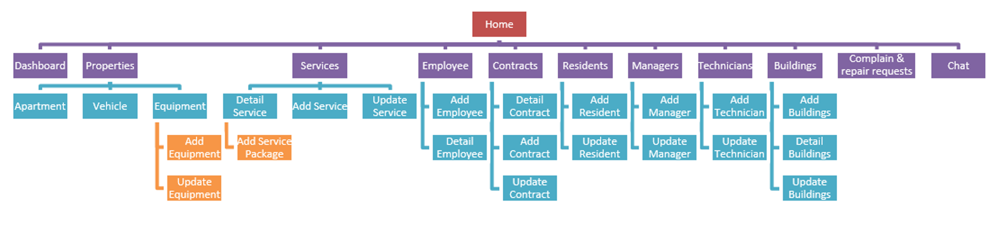
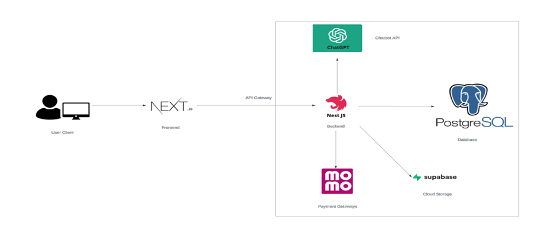
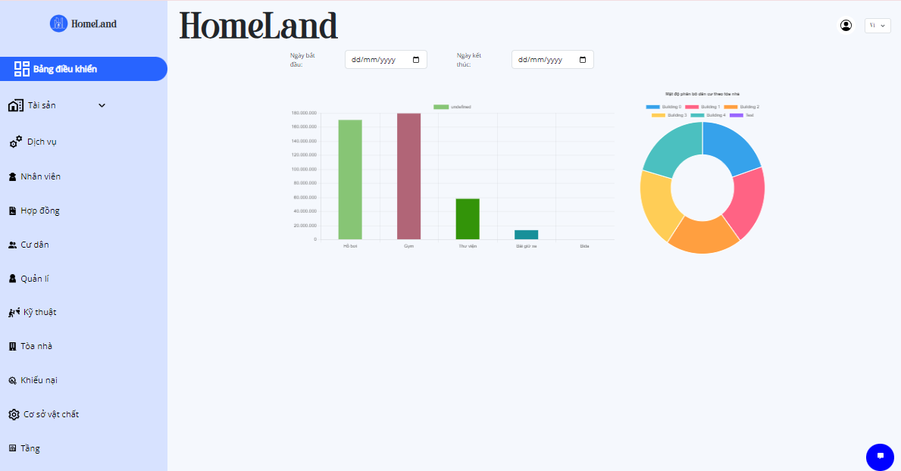
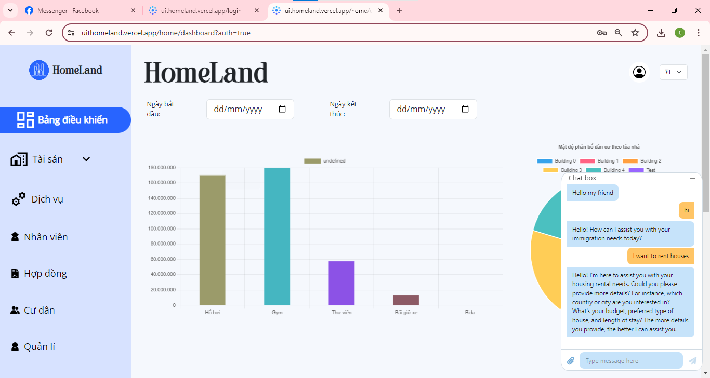
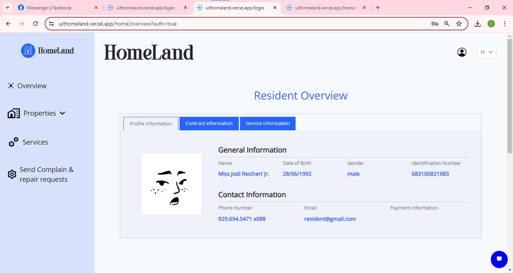
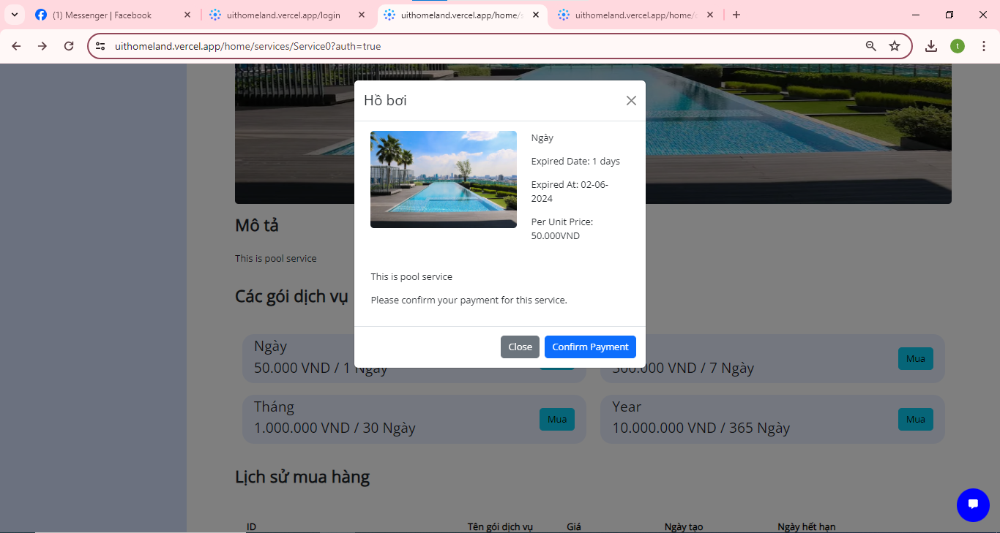
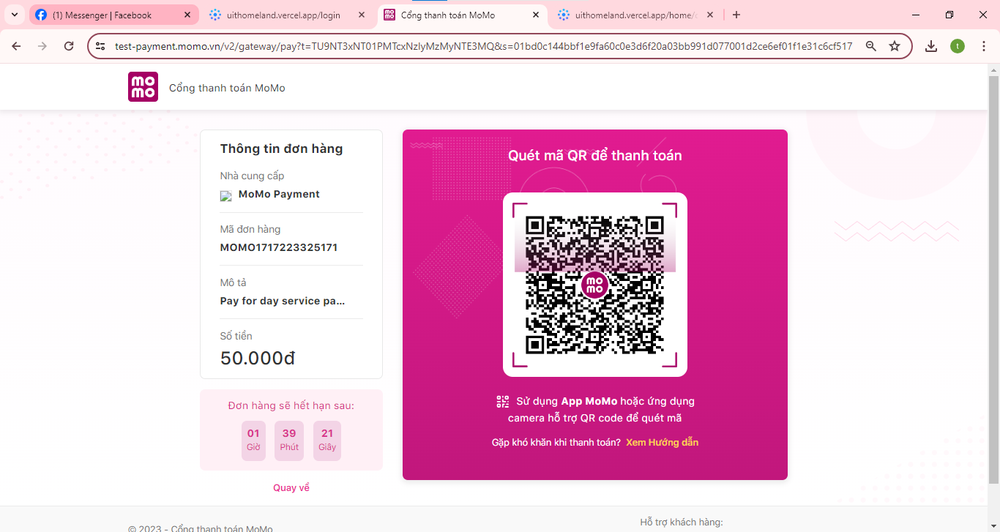

## PROJECT: HOMELAND WEB

### BUILDING A CONDOMINIUM MANAGEMENT WEBSITE
Instructor: Trần Tuấn Dũng
## Student Contributors:
| Leader  | Member | Member | Member | Member |
| ------------- | ------------- | --------------------------|------------------------|------------------------|
| [](https://github.com/ManhHoDinh) | [](https://github.com/phuochungus) | [](https://github.com/vocongbinh) | [](https://github.com/Daiduong1593572468) | [](https://github.com/Ngan1808) |
| [Hồ Đình Mạnh - 21522327](https://github.com/ManhHoDinh) | [Nguyễn Phước Hưng - 21520252](https://github.com/phuochungus) | [Võ Công Bình - 21521880](https://github.com/vocongbinh) | [Đinh Đại Dương - 21521986](https://github.com/Daiduong1593572468) | [Nguyễn Thị Kim Ngân - 20520915](https://github.com/Ngan1808) |


## Technologies Used:
* FrontEnd: 

* BackEnd: NestJS

* Other Technologies: Docker, Bootstrap, PostgreSQL, Supabase, Momo Payway, ChatGPT API,...


## 📚 Introduction
HomeLand is an apartment management website, it provides a centralized interface to view booking and appointment information, Manage communication with prospects, customers and tenants, Track maintenance work and clean up, create dashboards and visualizations for daily reporting.
## Roadmap


## Functionalities
* Information Management: Building information, residents, resident vehicles,...
* Service Management: Expense management, service contracts, services (electricity, water,...)
* Asset Management: Maintenance management and repair assignment
* Financial Management: Fee calculation and issuance of fee notifications (linked to banking applications, e-wallets) through various forms such as email, SMS, printing, and within the application for residents. Financial reporting system and statistics on income and expenditure of fees in the condominium.

* Rental Contract Management: a library of templates that comply with all the latest standards, allowing you to create new leases. The system creates a data warehouse of all your rental data and sends notifications about expiring and terminated contracts. You can also include specialized clauses in your contract and automatically track violations and late fees.

* Report Generation: Overall population statistics, you can export reports in many chart formats by date,....

* Financial reports: The software provides the ability to automate a large portion of accounting and maintenance operations, distribute to owners and suppliers, submit financial reports, and manage regulatory compliance.

* Complain & repair request: Enter a complaint comment and display a list of complaints.

## 📋 Agency 
This area is designed for agency or company who want to sell their properties. Make a transaction to take turns and post some news.


## 🕵️ Admin
Designed for admin, real estate broker and office manager too. Admin reviews every post and account information, after pass his review, the post will immediately post into the market.

## Illustrative Images:









## Install
[Next.js](https://nextjs.org/) project bootstrapped with [create-next-app](https://github.com/vercel/next.js/tree/canary/packages/create-next-app).

To install the app, you will need to have the following installed:
```
npm run dev
# or
yarn dev
# or
pnpm dev
# or
bun dev
```
Open http://localhost:3000 with your browser to see the result.

You can start editing the page by modifying ```app/page.tsx```. The page auto-updates as you edit the file.

This project uses [```next/font```](https://nextjs.org/docs/pages/building-your-application/optimizing/fonts) to automatically optimize and load Inter, a custom Google Font.

## HOW TO BUILD
```bash
# clone repository
$ git clone https://github.com/ManhHoDinh/HomeLand.git
$ cd HomeLand

# install dependencies
$ npm install

# pull necessary images
$ docker compose pull

# rename .env.example to .env
# you might change some variable if you need to connect to real redis, postgresql or supabase project
$ cp .env.example .env
```

## HOW TO RUN
```bash
# docker compose include redis and postgresql
# if your local machine have redis or postgresql, please turn off all in order to run properly
$ docker compose up -d

# start supabase local
$ npx supabase start

# start nestjs
$ npm run start:dev

# you might need to send HTTP GET to this endpoint to create empty database and S3 storage:
http://localhost:3000/seed/init
```

## Learn More
To learn more about Next.js, take a look at the following resources:

 * [Next.js Documentation](https://nextjs.org/docs) - learn about Next.js features and API.
 * [Learn Next.js](https://nextjs.org/learn) - an interactive Next.js tutorial.
You can check out [the Next.js GitHub repository](https://github.com/vercel/next.js/) - your feedback and contributions are welcome!

## Deploy on Vercel
The easiest way to deploy your Next.js app is to use the [Vercel Platform](https://vercel.com/docs/vercel-platform) from the creators of Next.js.

Check out our [Next.js deployment documentation](https://nextjs.org/docs/pages/building-your-application/deploying) for more details.
## 💕 Thanks
This project almost completed like a real estate brokerage market. However developed by developer team who is still university students and have not enough experiences, this project maybe has some problem. You can visit our deploy website for more experience. Thank you for visiting our project.

I deeply appreciate every member of this team for showing relentless effort for this project.

## Additional information

Develop by:
 [Hồ Đình Mạnh - 21522327](https://github.com/ManhHoDinh) 
 Email: 21522327@gm.uit.edu.vn

 [Nguyễn Phước Hưng - 21520252](https://github.com/phuochungus) 
 Email: 21520252@gm.uit.edu.vn

 [Võ Công Bình - 21521880](https://github.com/vocongbinh) 
 Email: 21521880@gm.uit.edu.vn

 [Đinh Đại Dương - 21521986](https://github.com/Daiduong1593572468) 
 Email: 21521986@gm.uit.edu.vn

 [Nguyễn Thị Kim Ngân - 20520915](https://github.com/Ngan1808)
 Email: 20520915@gm.uit.edu.vn

Link reference to BE: [HomelandBE](https://github.com/ManhHoDinh/HomeLandBE)