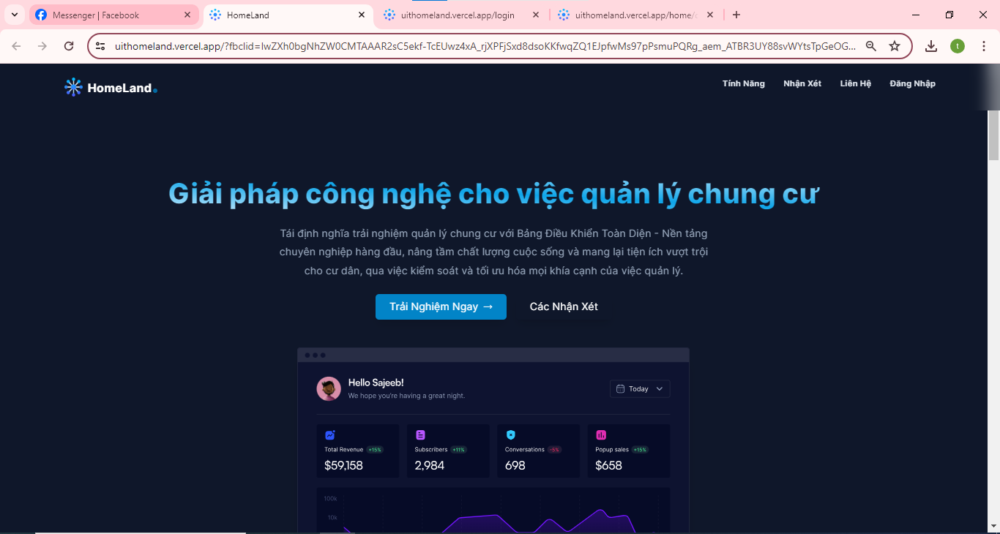
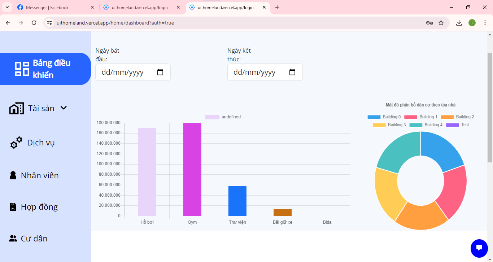

## PROJECT: HOMELAND WEB
Website Demo: [Homeland](https://uithomeland.vercel.app/)
Backend Repository: [HomelandBE](https://github.com/ManhHoDinh/HomeLandBE)
Video demo: [Youtube](https://www.youtube.com/watch?v=YjaR-8Sp0UU&t=6s)
### BUILDING A CONDOMINIUM MANAGEMENT WEBSITE
Instructor: Trần Tuấn Dũng
## Student Contributors:
| Leader  | Member | Member | Member | Member |
| ------------- | ------------- | --------------------------|------------------------|------------------------|
| [](https://github.com/ManhHoDinh) | [](https://github.com/phuochungus) | [](https://github.com/vocongbinh) | [](https://github.com/Daiduong1593572468) | [](https://github.com/Ngan1808) |
| [Hồ Đình Mạnh - 21522327](https://github.com/ManhHoDinh) | [Nguyễn Phước Hưng - 21520252](https://github.com/phuochungus) | [Võ Công Bình - 21521880](https://github.com/vocongbinh) | [Đinh Đại Dương - 21521986](https://github.com/Daiduong1593572468) | [Nguyễn Thị Kim Ngân - 20520915](https://github.com/Ngan1808) |


## Technologies Used:
* FrontEnd: 

* BackEnd: NestJS

* Other Technologies: Docker, Bootstrap, PostgreSQL, Supabase, Momo Payway, ChatGPT API,...


## 📚 Introduction
HomeLand is an apartment management website, it provides a centralized interface to view booking and appointment information, Manage communication with prospects, customers and tenants, track maintenance work and clean up, create dashboards and visualizations for daily reporting.
## Roadmap


## Functionalities
* Information Management: Building information, residents, resident vehicles,...
* Service Management: Expense management, service contracts, services (electricity, water,...)
* Asset Management: Maintenance management and repair assignment
* Rental Contract Management: a library of templates that comply with all the latest standards, allowing you to create new leases. The system creates a data warehouse of all your rental data and sends notifications about expiring and terminated contracts. You can also include specialized clauses in your contract and automatically track violations and late fees.

* Report Generation: Overall population statistics, you can export reports in many chart formats by date,....

* Complain & repair request: Enter a complaint comment and display a list of complaints.

## 🕵️ Admin
Designed for admin, admin is the owner of an apartment. Admin manage account information, equipment, contract, vehicle resident, building, floor, and apartment. And Admin will asign task to technicain.

## 📋 Resident 
This area is designed for resident. Resident can buy a service, complant some issues.

## 📋 Technicain
Designed for technicain who will fix some issues, see report of tasks, and create a invoice to resident or admin.

## Illustrative Images:





## Install
[Next.js](https://nextjs.org/) project bootstrapped with [create-next-app](https://github.com/vercel/next.js/tree/canary/packages/create-next-app).

To install the app, you will need to have the following installed:
```
npm run dev
# or
yarn dev
# or
pnpm dev
# or
bun dev
```
Open http://localhost:3000 with your browser to see the result.

You can start editing the page by modifying ```app/page.tsx```. The page auto-updates as you edit the file.

This project uses [```next/font```](https://nextjs.org/docs/pages/building-your-application/optimizing/fonts) to automatically optimize and load Inter, a custom Google Font.

## 💕 Thanks
This project is almost completed like apartment management. However developed by the developer team who is still university students and have not enough experiences, this project maybe has some problem. You can visit our deploy website for more experience. Thank you for visiting our project.

I deeply appreciate every member of this team for showing relentless effort for this project.

## Additional information

Develop by:
 [Hồ Đình Mạnh - 21522327](https://github.com/ManhHoDinh) 
 Email: 21522327@gm.uit.edu.vn

 [Nguyễn Phước Hưng - 21520252](https://github.com/phuochungus) 
 Email: 21520252@gm.uit.edu.vn

 [Võ Công Bình - 21521880](https://github.com/vocongbinh) 
 Email: 21521880@gm.uit.edu.vn

 [Đinh Đại Dương - 21521986](https://github.com/Daiduong1593572468) 
 Email: 21521986@gm.uit.edu.vn

 [Nguyễn Thị Kim Ngân - 20520915](https://github.com/Ngan1808)
 Email: 20520915@gm.uit.edu.vn
